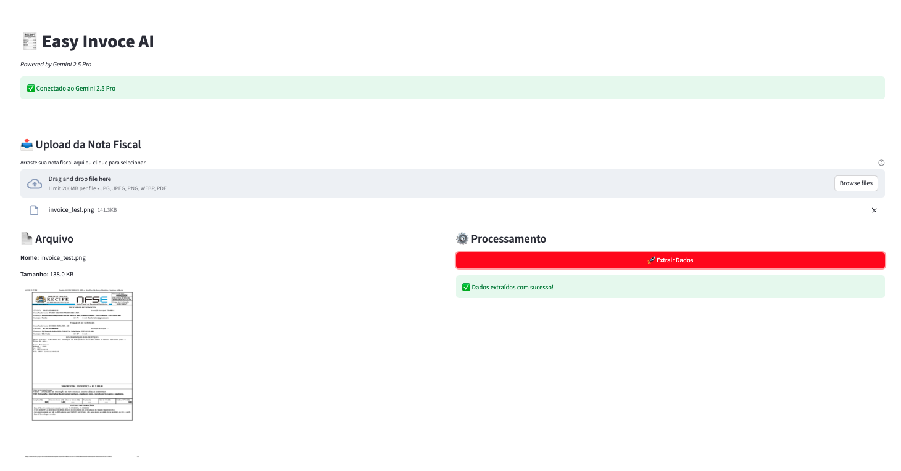

# 🧾 EasyInvoiceAI

Extract invoice data automatically using AI. Just drag and drop!


## 📋 Overview

EasyInvoiceAI is an intelligent invoice data extractor powered by Google's Gemini 2.5 Pro. Upload an invoice image or PDF, and get structured data in seconds.

### ✨ Features

- 🖱️ **Drag & Drop** - Simple file upload interface
- 📄 **Multiple Formats** - Supports JPG, PNG, PDF
- 🤖 **AI-Powered** - Uses Gemini 2.5 Pro for accurate extraction
- 📊 **Structured Output** - Get data in JSON and CSV formats
- 📈 **History Tracking** - All extractions saved automatically
- ⬇️ **Easy Export** - Download individual or consolidated data

### 📸 Screenshot

```



```

## 🚀 Quick Start

### 1. Clone the repository

```bash
git clone https://github.com/YOUR_USERNAME/easy-invoice-ai.git
cd easy-invoice-ai
```

### 2. Create virtual environment

```bash
python -m venv .venv
source .venv/bin/activate  # Linux/Mac
# or
.venv\Scripts\activate     # Windows
```

### 3. Install dependencies

```bash
pip install -r requirements.txt
```

### 4. Configure API Key

Create a `.env` file in the project root:

```env
GEMINI_API_KEY=your_api_key_here
```

> 📌 Get your API key at: https://aistudio.google.com/app/apikey

### 5. Run the app

```bash
streamlit run app.py
```

The app opens automatically at `http://localhost:8501`

## 💻 Usage

### Web Interface (Streamlit)

```bash
streamlit run app.py
```

### Command Line (CLI)

```bash
# Single file
python invoice_extractor.py invoice.pdf

# Multiple files
python invoice_extractor.py *.jpg
```

## 📁 Project Structure

```
easy-invoice-ai/
├── .env                    # API key (not in repo)
├── .gitignore              # Ignored files
├── README.md               # This file
├── requirements.txt        # Dependencies
├── app.py                  # Streamlit web interface
├── invoice_extractor.py    # CLI version
└── invoices_json/          # Extracted data (generated)
```

## 📊 Output Format

### JSON Structure

```json
{
  "emitente": {
    "razao_social": "Company Name",
    "cnpj": "12.345.678/0001-99",
    "endereco": "Street, 123"
  },
  "data_emissao": "27/10/2025",
  "numero_nota": "000001",
  "itens": [
    {
      "descricao": "Product A",
      "quantidade": 2,
      "valor_unitario": 50.00,
      "valor_total": 100.00
    }
  ],
  "valor_total_nota": 100.00,
  "impostos": {
    "icms": 18.00,
    "iss": null
  }
}
```

### CSV Columns

| Column | Description |
|--------|-------------|
| data_extracao | Extraction timestamp |
| arquivo_origem | Source filename |
| razao_social | Company name |
| cnpj | Tax ID |
| data_emissao | Invoice date |
| numero_nota | Invoice number |
| qtd_itens | Number of items |
| valor_total_nota | Total value |

## 🛠️ Tech Stack

- **Python** 3.10+
- **Streamlit** - Web interface
- **Google Gemini 2.5 Pro** - AI extraction
- **Pillow** - Image processing
- **pdf2image** - PDF support
- **python-dotenv** - Environment variables

## 📦 PDF Support

To enable PDF support, install poppler:

```bash
# Mac
brew install poppler

# Ubuntu/Debian
sudo apt-get install poppler-utils

# Windows
# Download from: https://github.com/oschwartz10612/poppler-windows/releases
```

## 🤝 Contributing

Contributions are welcome! Feel free to:

1. Fork the project
2. Create a feature branch (`git checkout -b feature/amazing`)
3. Commit your changes (`git commit -m 'Add amazing feature'`)
4. Push to the branch (`git push origin feature/amazing`)
5. Open a Pull Request

## 📄 License

This project is licensed under the MIT License - see the [LICENSE](LICENSE) file for details.

## 👤 Author

**Pedro Andrade**

- GitHub: [@pedroandrade-tech](https://github.com/pedroandrade-tech)
- LinkedIn: [pedro-andrade](https://www.linkedin.com/in/pedro-andrade-959214243/)

---

⭐ If this project helped you, please give it a star!
